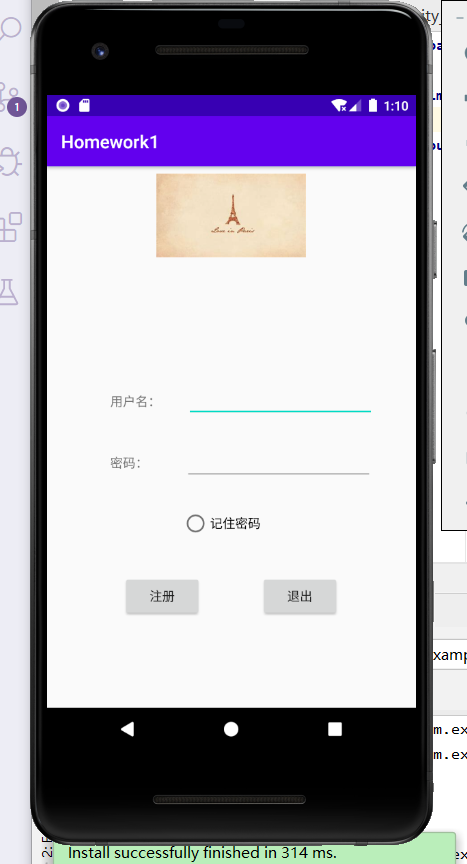
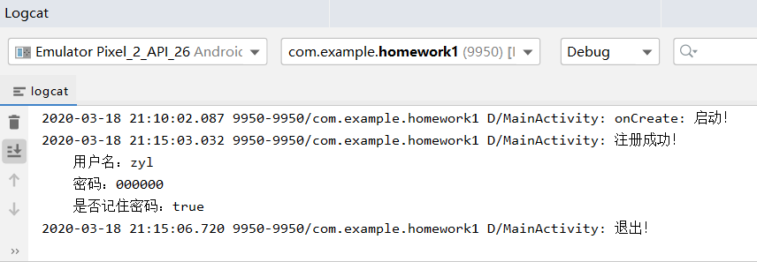

# android-studio-learn
移动互联网技术及应用课程实操

## 一、homework1
> 2020-03-16
### 任务要求
+ 创建一个Android app工程，包含一个activity（环境可以参考 demo）
+ 使用5种以上的View并实现一些简单交互
    + ImageView, Button, TextView, RadioButton, CheckBox，EditText, ProgressBar, SeekBar, Switch 等等不限
+ 将一些交互结果输出log
+ 打包生成apk
+ 把练习代码上传到github仓库里
### 任务实现
+ 参照demo新建Android app工程
+ 实验环境
    + Windows10
    + Android Studio 3.6.1
    + JDK8
    + Gradle-5.1.1-all
    + 模拟器: Pixel2 API26
+ 实现效果
    + 包含5种view
        + 图片logo -> ImageView
        + 用户名和密码提示框 -> TextView
        + 用户名和密码输入框 -> EditText
        + 记住密码单选按钮 -> RadioButton
        + 注册和退出按钮 -> Button
    + UI截图
    
    + 交互
        + 启动日志记录启动信息
        + 可输入用户名和密码
        + 可勾选记住密码
        + 点击注册日志记录注册信息
        + 点击退出日志记录退出信息并退出程序
    + 日志记录截图
    

